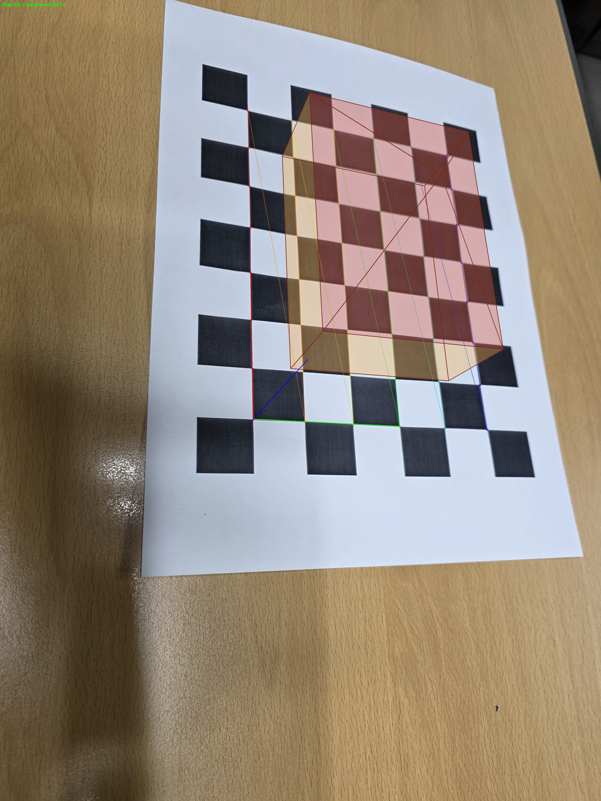
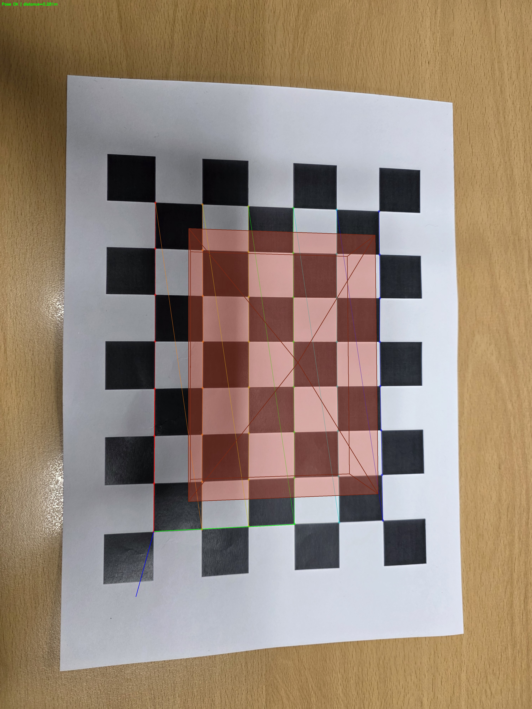
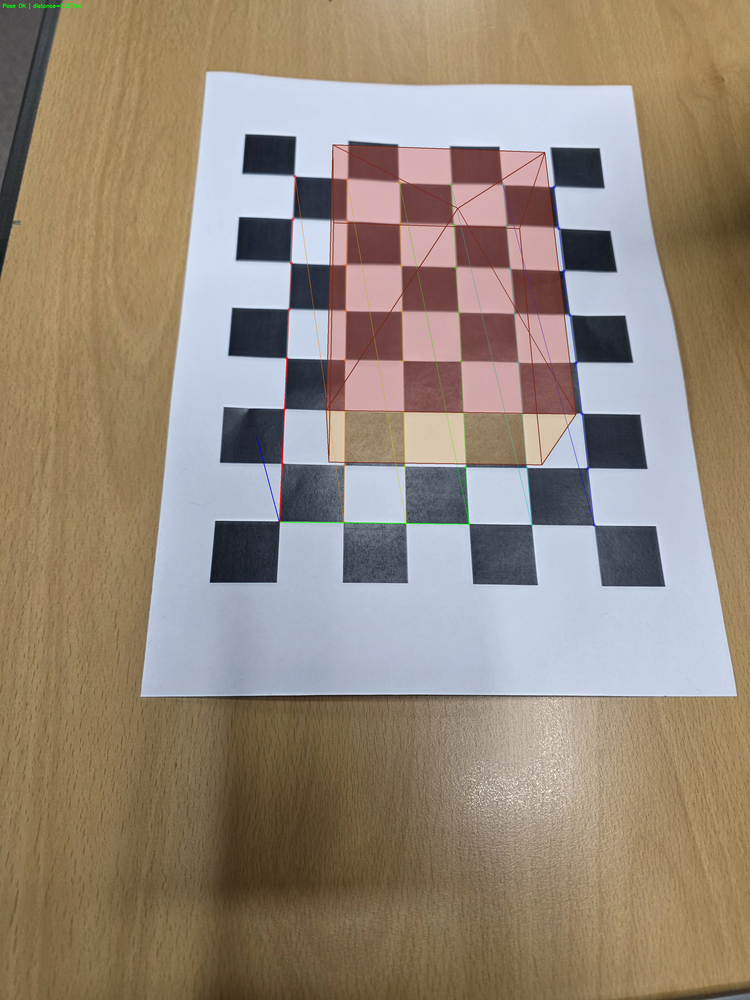
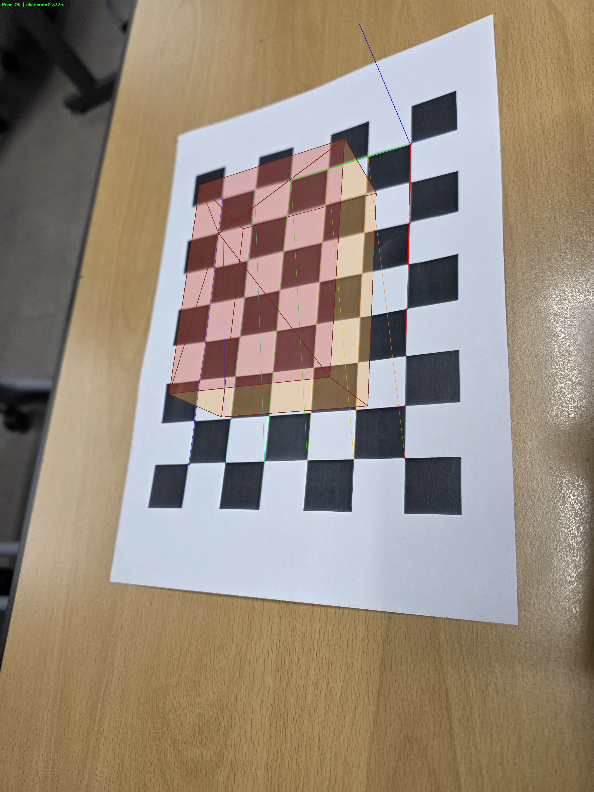
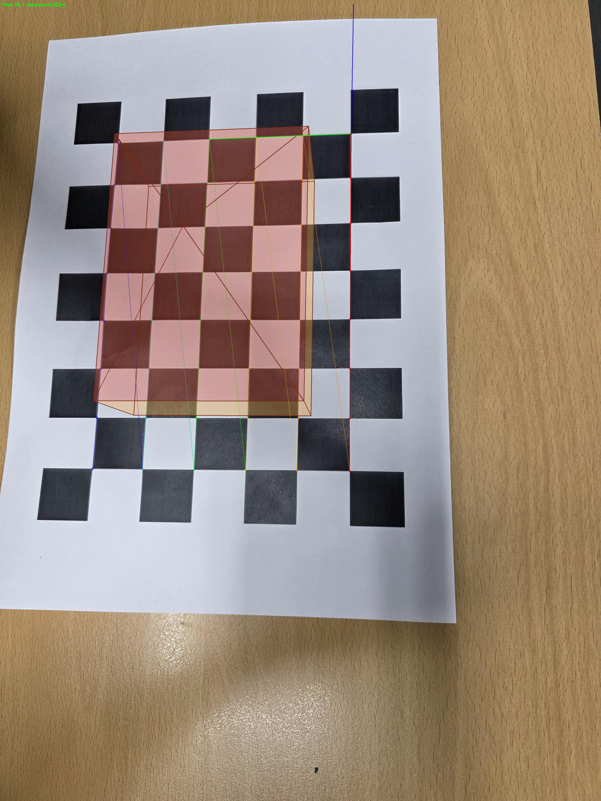

# Rectangle_on_ChessBoard

카메라 캘리브레이션 결과를 사용해 체스보드의 자세를 추정하고, 체스보드 위에 AR 물체를 표시하는 코드입니다.

## 목표

- 내 카메라 캘리브레이션 결과를 이용해 camera pose estimation 수행
- 체스보드 위에 AR 물체(예제와 다른 형태)를 시각화
- README에 AR 결과 데모 이미지 포함

## 폴더 구성

- `camera_calibration.py`: 체스보드 이미지로 캘리브레이션 수행
- `pose_estimation_chessboard.py`: pose 추정 후 AR 물체(집 모양 3D) 오버레이
- `data/chessboard/`: 캘리브레이션/테스트용 체스보드 이미지
- `data/calibration/calibration_result.npz`: 캘리브레이션 결과
- `ar_results/`: AR 결과 이미지 저장 폴더

## 실행 순서

1. 카메라 캘리브레이션

```bash
python camera_calibration.py
```

기본 출력 파일:

- `data/calibration/calibration_result.npz`

2. Camera Pose Estimation + AR 실행(이미지)

```bash
python pose_estimation_chessboard.py --mode image --input data/chessboard/chess_*.jpg --output ar_results --calib data/calibration/calibration_result.npz
```

## 캘리브레이션 파일 요구사항

- 필수 키: `K`, `dist_coeff`
- 선택 키: `board_pattern`, `board_cellsize`

현재 스크립트는 `board_pattern`, `board_cellsize`가 있으면 자동으로 읽고, 없으면 기본값을 사용합니다.

## AR 자산(에셋) 필요 여부

- 별도 AR asset 파일은 필요하지 않습니다.
- 현재 코드는 체스보드 위에 집 모양 3D AR 오브젝트를 직접 그립니다.
- 나중에 커스텀 모델을 쓰고 싶을 때만 별도 자산 파일을 추가하면 됩니다.

## 결과물 설명

- `data/calibration/calibration_result.npz`
  - `K`, `dist_coeff` 포함
- `ar_results/chess_01_pose_ar.jpg` ~ `ar_results/chess_05_pose_ar.jpg`
  - 체스보드 코너 기반 pose estimation 결과
  - 체스보드 위 AR 물체 오버레이 결과

## AR 결과 이미지







## 참고

- 기본 체스보드 내부 코너 패턴은 `8 x 6`
- 패턴이 다르면 캘리브레이션 시 `--board_cols`, `--board_rows`로 조정
